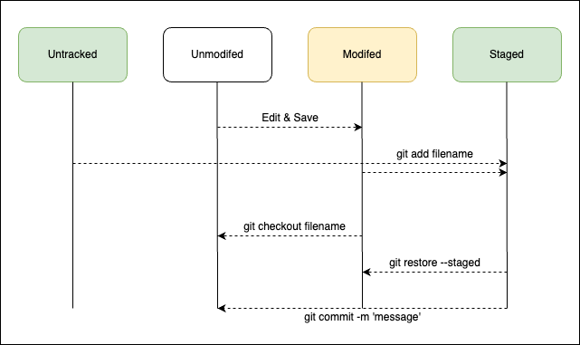

# Git

## git을 사용하는 이유

모든 코드들은 완벽하지 않다. 특히 상황에 따라서 코드를 수정해야할 경우가 많이 생긴다.  
이때 코드를 수정하고 저장하다보면 자신이 변경한 시점과 내용이 기억나지 않을 수 있다.  
그래서 버전 관리 시스템인 git을 이용해 각 버전을 편하게 관리할 수 있다.  

## git & github를 사용하는 법 (VSCODE & Ubuntu Terminal)

Ubuntu를 설치하면 git은 자동으로 설치되어있다.  

```
git --version
```
위 코드로 버전을 확인할 수 있다.  

```
git config --global user.name=name
git config --global user.email=thisisfake@email.com
```
위의 코드가 안될 경우 아래 코드로 직접 변경할 수 있다.
```
git config --global -e
```

`git clone`을 통해 편집하고자 하는 repogitory를 local에서 작업한다.  
그 후 `git push`를 통해 github에 다시 업데이트를 하면 된다.  

## 용어 정리

`add`
- 각 파일을 Staged로 올리기 위한 명령어다.

`Staged`
- 변경된 버전들이 저장된 장소

`commit`
- 버전을 기록할 Staged 시점을 기록한다. (카메라로 사진을 찍는다고 생각)

`checkout`
- 브랜치 내에서 파일을 변경하기 전으로 되돌릴때 사용할 수 있다. (되돌릴 파일 이름을 입력)
- 브랜치를 이동하는데 사용할 수 있다. (이동할 브랜치를 입력)


`push` 
- 현재 repogitory의 저장된 commit들을 github에 업데이트한다.

`pull`
- local과 비교하여 github에 업데이트 되어있는 부분을 다운한다.

`fetch`
- local과 비교하여 github에 업데이트 되어있는 부분이 있는지 확인한다.

## Overview


## 나중에 추가로 정리할 topic
- `.gitignore`
- Conflict? Not a problem!
- Stashing
- Tagging
- Authentication for private repos
- Rebase, and `--force` flags - the red button
- Large File Storage (LFS)
- Submodule
- Combination with `docker`
